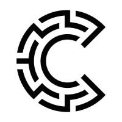

<h1 align="center">Hi there 👋</h1>

<!-- bio starts -->

My name is Daniel Zajac. I thrive on crafting software solutions, always hoping to push boundaries and spark interest.

Please [reach out](mailto:danzajac10@gmail.com) and say hi.

---

<h3 align="center">Senior Software Engineer</h3>

  

- 🔭 I’m currently working on my personal project.

- 💬 Ask me about **Laravel / Vue.js / React.js / Next.js / ECommerce development / Azure / AWS**.

- 👯 I’m open to collaborating with **a startup to tackle dynamic challenges or with a larger company to contribute and grow in a team-oriented culture**.

- 🌱 I’m currently learning **ASP.NET**.

- ⚡ Stil, excited for the future. Although a bit worried about the present.

- 😄 Pronouns: he/him or they/them

- 📍 Locale: Pennsylvania

- 📫 How to reach me **danzajac10@gmail.com**

<h3 align="left">📜 Experience</h3>

My background is building high performance, full stack applications for front office business users and developers, focusing on streaming data and analytics.

 

| | | | |
|:--:|:--:|:--:|:--:|
| </img> | [T-Mobile](https://www.t-mobile.com/) | PHP/Laravel VueJS Developer | 2019- |
| </img> | [Confidential](https://www.linkedin.com/company/goconfidentia) | PHP Developer | 2017-2019 |
| </img> | [BizEquity](https://www.bizequity.com/) | Software Engineer | 2014-2017 |
| </img> | [PNC](https://www.pnc.com/) | Senior PHP/Drupal Developer | 2013-2014 |

<h3>🚀 Languages and Tools I Use</h2>

 

 

 

 
 
 

 
 

 
 

 

 
 
 

 

 
 

     

